# AWS EKS By Rancher

This repo intends to help customers to create a EKS Cluster managed by Rancher running in a EC2 instance.

# Architecture Overview

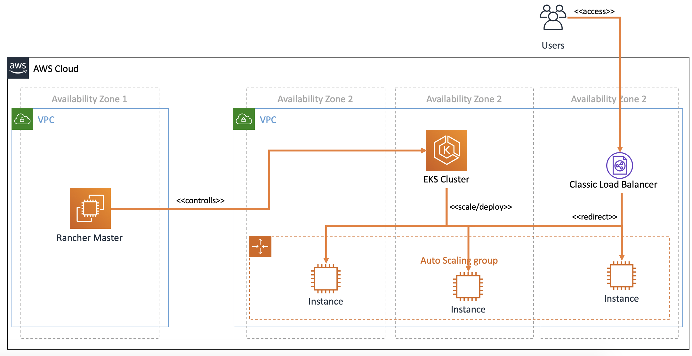

# Requirements

- AWS Account 
- [AWS CLI](https://docs.aws.amazon.com/pt_br/cli/latest/userguide/cli-chap-install.html)

# How to Deploy

## EC2

- Clone this repo: 
` git clone https://github.com/mandalvesq/eks-by-rancher.git `

- [Create a KeyPair](https://docs.aws.amazon.com/pt_br/AWSEC2/latest/UserGuide/ec2-key-pairs.html)

- Run Cloudformation on your AWS Account: 

``` 
  cd eks-by-rancher/
  aws cloud formation create stack --stack-name stack-ec2-rancher --template-body file://template.yml --parameters KeyPairName=<YOUR-KEY-PAIR-NAME> --capabilities CAPABILITY_IAM
```

- Log into EC2 Instance e run the startup script:

```
  chmod u+x startup.sh
  ./startup.sh
```

- Check if the Rancher container is running: `sudo docker ps -a`
The output must be something like: 

`ca9ce81a91e8        rancher/rancher:latest   "entrypoint.sh"     2 minutes ago       Up 39 seconds       0.0.0.0:80->80/tcp, 0.0.0.0:443->443/tcp   rancher`

# Rancher configurations 

## First login 
- Get your public IP from EC2 
- Browser the public IP on port 80
- Configure Password 
- Log into Rancher using admin and password created

## Deploy Cluster 

- Click in ADD Cluster 

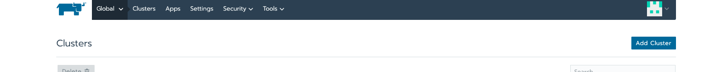

- Choose EKS

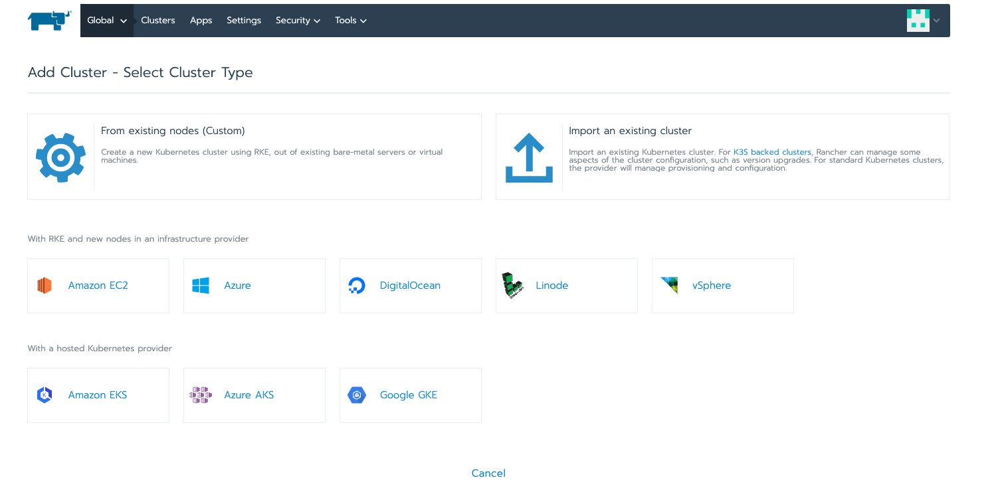

- Choose the region (in this case us-east-1) and put the Access Key and Secret Key (you can get those from CloudFormation Ouputs)

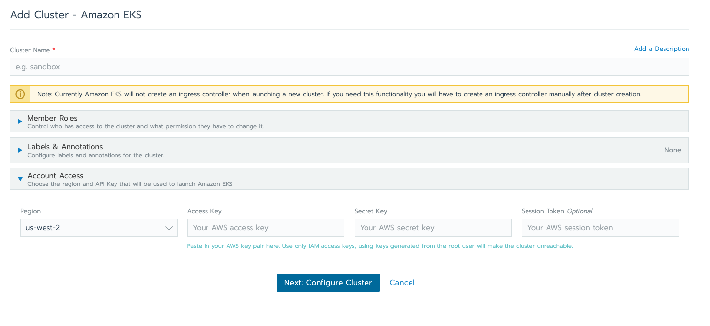

- Choose K8s version

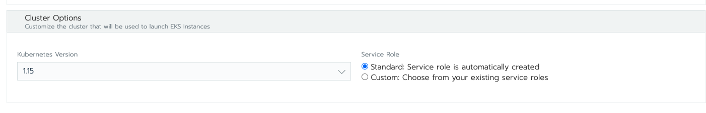

- Choose VPC configurations and Instance type based on your needs.


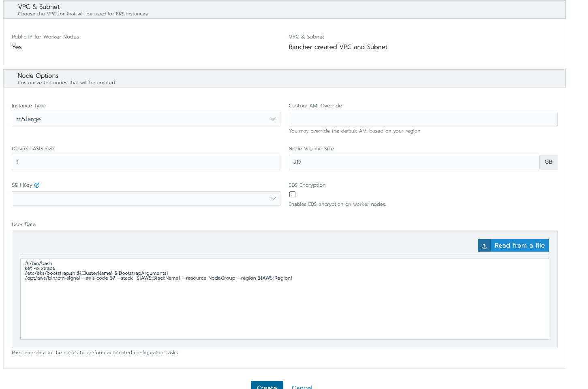

- Click Create

- As soon as cluster been deployed, you will see the following page:

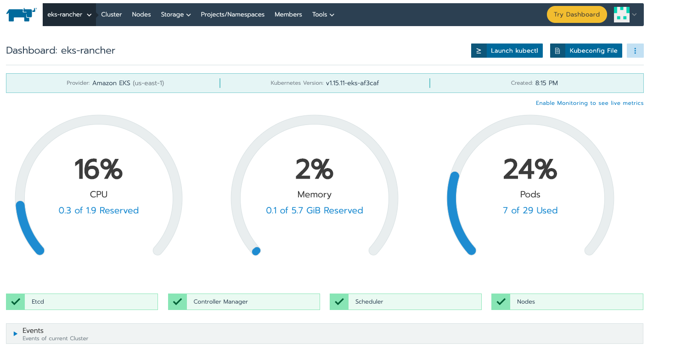


## Deploy Workload

- Go to Cluster and choose the Cluster that we just create

- Click in Deploy

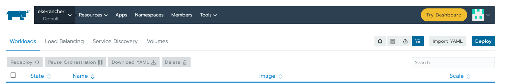

- Choose the Docker image
- Set port and port type, for this example we will use LB Layer 4

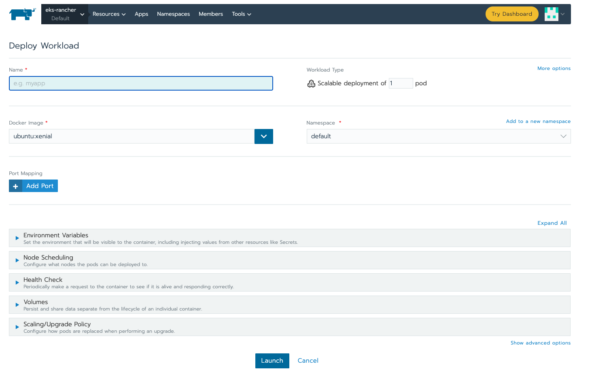

- Click in Launch

- After Launch, Go to Load Balancer section and see if the LB is Active

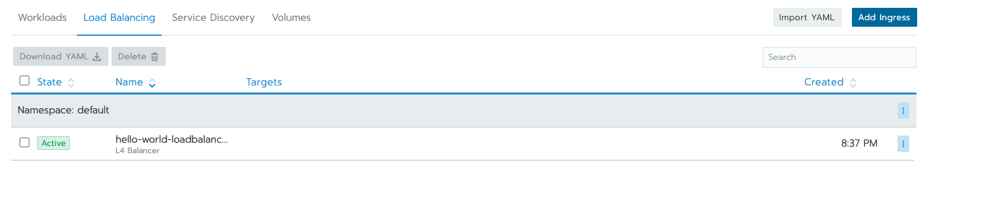

- Return to Workloads and then click in 80/tcp link. It will redirects to the DNS of the AWS Load Balancer.

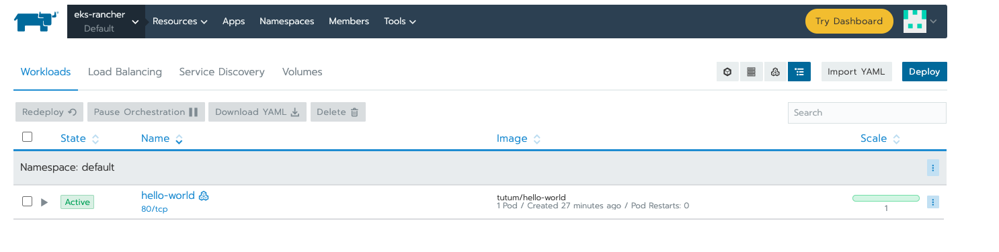

- You should be abble to see the example running


# Roadmap 

- Rancher supports Fargate: https://github.com/rancher/rancher/issues/24909
- Rancher supports SPOT Instances: https://github.com/rancher/rancher/issues/22042


